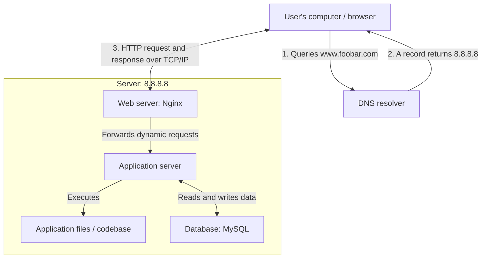

# Simple Web Stack

## Request Flow

1. A user enters `www.foobar.com` in a browser.
2. The DNS resolver looks up the `A` record for `www.foobar.com` and returns
   the server IP address `8.8.8.8`.
3. The browser opens a TCP connection to `8.8.8.8` and sends an HTTP request
   to Nginx.
4. Nginx can serve static content directly or forward a dynamic request to the
   application server.
5. The application server executes the codebase and reads from or writes to
   MySQL when persistent data is needed.
6. The response travels back through Nginx to the user's browser.

## Infrastructure Components

- **Server:** A physical or virtual computer that provides services to other
  computers over a network. This server hosts the entire web stack.
- **Domain name:** `foobar.com` gives users a human-readable name instead of
  requiring them to remember `8.8.8.8`.
- **DNS record:** `www` is a host name in the `foobar.com` domain. It is
  configured as an `A` record because it points directly to the IPv4 address
  `8.8.8.8`.
- **Web server:** Nginx accepts HTTP requests, serves static files, and acts as
  a reverse proxy for dynamic requests.
- **Application server:** It runs the application logic and produces dynamic
  responses by using the application code and database.
- **Application files:** The codebase contains the website's source code,
  configuration, and other application resources.
- **Database:** MySQL stores and retrieves persistent application data.
- **Communication:** The user's computer and server communicate using the
  TCP/IP protocol suite. HTTP is the application protocol used by this
  unencrypted design.

## Infrastructure Issues

- **Single point of failure (SPOF):** Every component is on one server. If that
  server fails, the entire website becomes unavailable.
- **Maintenance downtime:** Deploying code, restarting Nginx, upgrading
  software, or rebooting the server can interrupt the website.
- **Limited scalability:** CPU, memory, storage, and network capacity are
  limited to one machine, so the infrastructure cannot handle unlimited
  incoming traffic.
