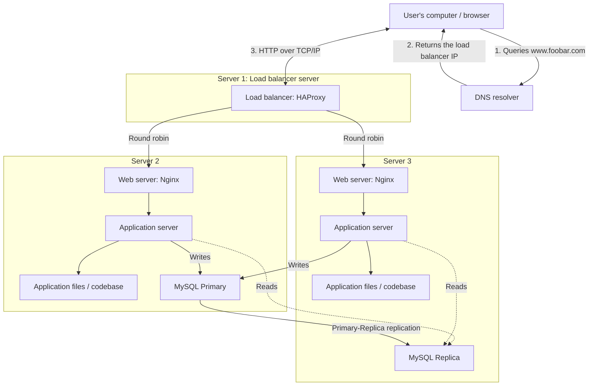

# Distributed Web Infrastructure

## Added Elements

- **HAProxy load balancer:** It distributes requests between the two
  application servers, preventing either server from receiving all incoming
  traffic and allowing one backend to continue serving traffic if the other
  backend fails.
- **Second application server:** It adds processing capacity and backend
  redundancy. Each backend server contains Nginx, an application server, a
  copy of the codebase, and a MySQL node.
- **MySQL Replica:** It keeps a copy of the Primary's data and can serve read
  queries, reducing read load on the Primary.

## Load-Balancer Configuration

HAProxy uses the **round-robin** algorithm. It sends the first request to one
backend server, the next request to the other backend server, and continues
alternating while both servers are healthy.

The backend web servers operate in an **Active-Active** setup because both
receive requests at the same time. In an **Active-Passive** setup, one server
would handle traffic while the other waited on standby and became active only
after a failure.

## Database Cluster

The MySQL Primary accepts data-changing operations. It records those changes
in its binary log, and the Replica reads and replays them to maintain a copy of
the data. Replication can have a short delay.

The application sends writes to the Primary. It can send read-only queries to
the Replica to distribute database load. The Replica should not normally
accept application writes because independent writes could make the nodes
inconsistent.

## Infrastructure Issues

- **Single points of failure:** The single HAProxy server can make every
  backend unreachable if it fails. The MySQL Primary is also a SPOF for writes
  unless an automated failover system promotes the Replica. The DNS setup and
  other shared external dependencies can also affect availability.
- **Security:** There are no firewalls restricting traffic and no HTTPS
  encryption, so requests and responses can be intercepted or modified.
- **No monitoring:** The infrastructure does not collect health, performance,
  traffic, or log data, making failures and capacity problems difficult to
  detect and diagnose.
