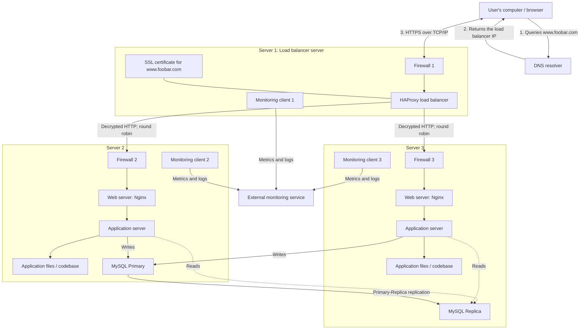

# Secured and Monitored Web Infrastructure

## Added Elements

- **Three firewalls:** Each server has a firewall that allows only required
  traffic. The load balancer firewall permits public HTTPS traffic, while the
  backend firewalls restrict access to trusted internal hosts and necessary
  service ports.
- **SSL certificate:** HAProxy uses the certificate for `www.foobar.com` to
  authenticate the website and encrypt traffic between the user and the load
  balancer with HTTPS.
- **Three monitoring clients:** One client runs on each server and collects
  operational data for an external service such as Sumo Logic.

## Security and Monitoring

Firewalls filter incoming and outgoing network connections according to rules.
They reduce the exposed attack surface by blocking unauthorized ports, hosts,
and protocols.

HTTPS protects the confidentiality and integrity of traffic and lets the
browser verify the website's identity through its SSL/TLS certificate.

Monitoring is used to detect failures, measure performance and capacity, track
availability, and support troubleshooting. Each monitoring client gathers
metrics and logs from its host and sends them over the network to the
monitoring service for storage, dashboards, and alerts.

To monitor Nginx queries per second (QPS), enable an Nginx metrics source such
as `stub_status` or analyze the access logs. Configure the monitoring client to
collect the request counter at regular intervals, calculate requests per
second, and create a dashboard and alert for abnormal values.

## Infrastructure Issues

- **SSL termination at HAProxy:** Traffic is encrypted only between the user
  and HAProxy. The diagram shows plain HTTP between HAProxy and the backend
  servers, so anyone with access to that network segment could inspect or
  alter it. Re-encrypting backend traffic would provide end-to-end protection.
- **Single writable MySQL Primary:** If the Primary fails, writes stop until a
  Replica is promoted. It can also become a write-performance bottleneck.
- **Identical mixed-purpose servers:** Running Nginx, the application server,
  application files, and MySQL on both backend machines creates resource
  contention and tightly couples deployment, maintenance, and scaling. The
  web, application, and database layers cannot be scaled independently.
- **Remaining load-balancer SPOF:** Security and monitoring do not remove the
  single HAProxy server as a point of failure.
